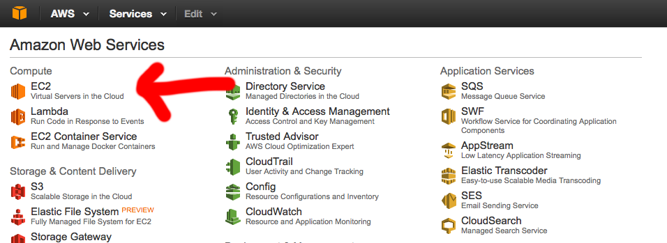

# Life Lessons: Amazon Web Services (AWS)

[Amazon](http://amazon.com) sells a lot more than books! [Amazon Web Services](https://en.wikipedia.org/wiki/Amazon_Web_Services) is a collection of a million and one cloud computing web services that help power the internet.

## Part Zero: Signing Up

You'll need to visit [https://aws.amazon.com](https://aws.amazon.com) and sign up through a somewhat-complicated process. I'm not sure about how it works with international Amazon accounts, so apologies in advance if you need to make one specifically for Amazon.com.

1. You can use the same account as for normal Amazon purchases
2. Add a credit card (you won't be billed, notice all the free stuff)
3. Authorize via a call to your phone
4. Choose the free support plan, of course
5. Click "Launch Management Console" when you're all done.
6. Be breathless at the wealth of computing resources at your command
7. Be breathless at *what do all of those things mean?*

[Signup process notes with images here](13-aws-signup.md)

# Part One: Mechanical Turk

[Mechanical Turk](https://www.mturk.com/mturk/welcome) is a service where you pay small sums of money to have human beings complete simple tasks. Whether it's typing up PDFs, tagging images or manually "scraping" information from the Internet, Mechanical Turk is great for tasks that are just outside of the realm of Python's capabilities.

(It isn't *technically* part of AWS, but close enough!)

Mechanical Turk's signup process is a little rough, so I'm just going to demo it in class.

The only thing to note is that if you're trying to post jobs it's called being a **Requester** and if you're trying to work for pennies it's called being a **Worker**.

[what we'll put up](13-aws-turk.md)

## Part Two: EC2

EC2 stands for [Elastic Compute Cloud](https://console.aws.amazon.com/ec2/v2/home), which is a fancy way of saying "a custom computer,". more or less You can launch your management console and click EC2 up in the top right.

Check out our [quickstart here](13-aws-ec2.md).

## Part Three: S3

S3 stands for [Simple Storage Service](https://console.aws.amazon.com/ec2/v2/home), and is used to host files online. If you have large or many files it's a great alternative to hosting them yourself.